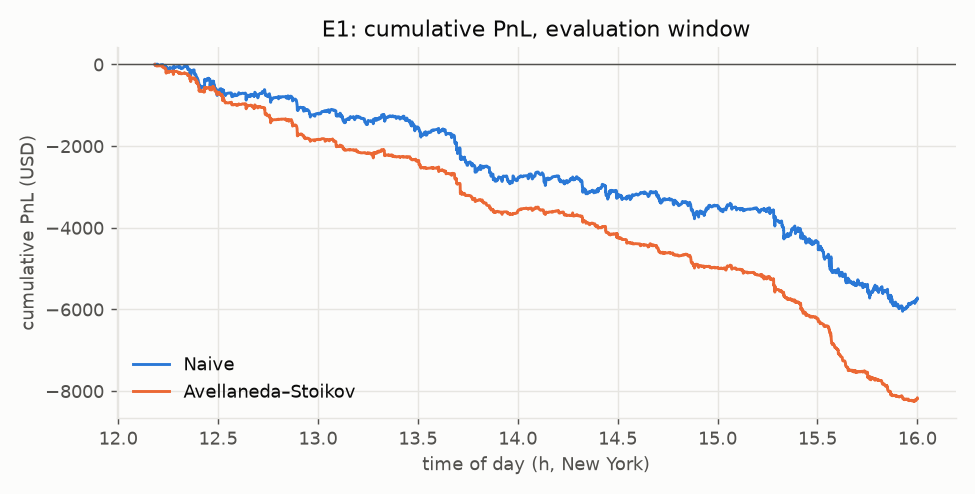
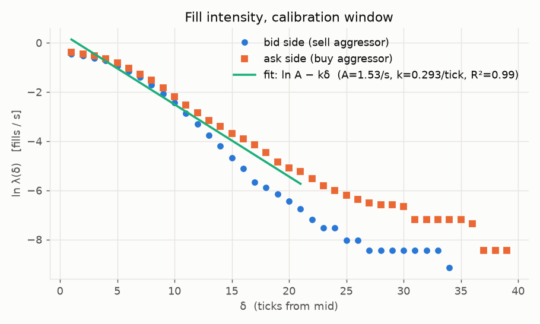
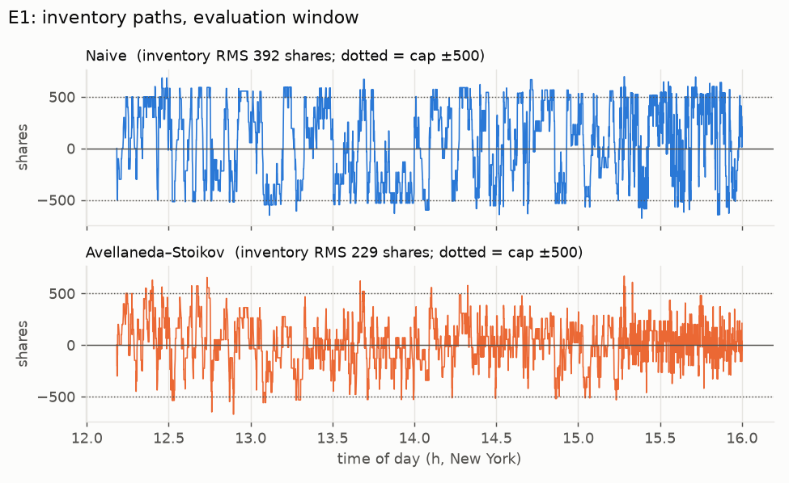
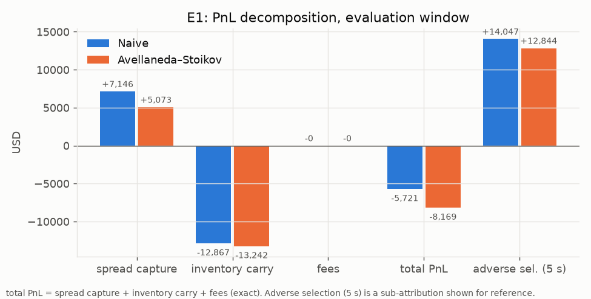
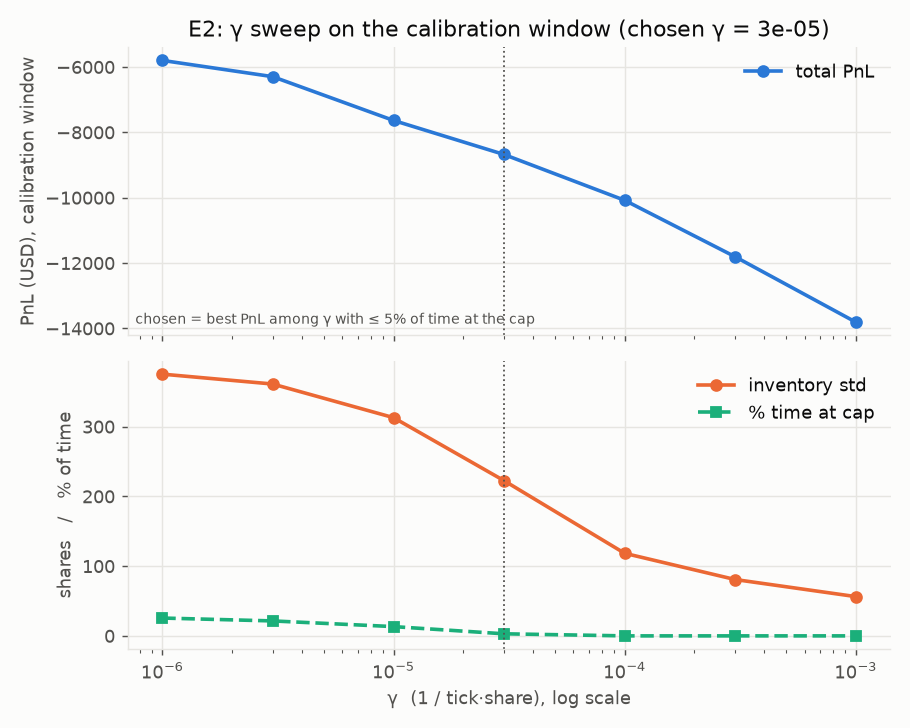
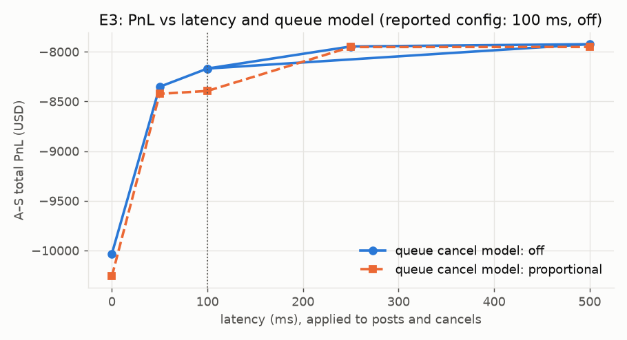
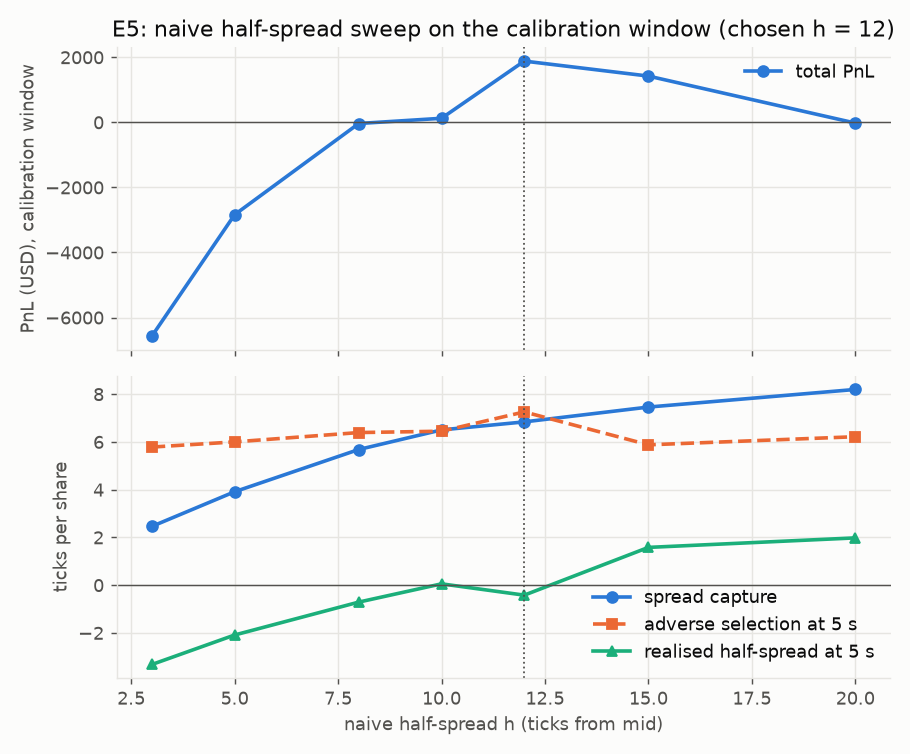
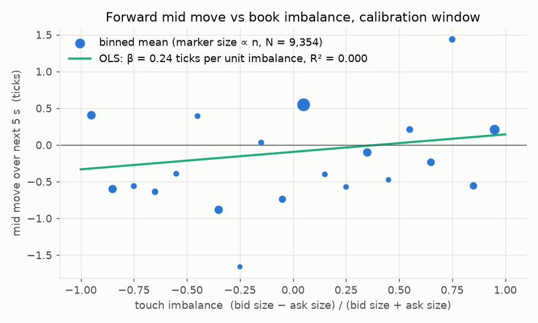
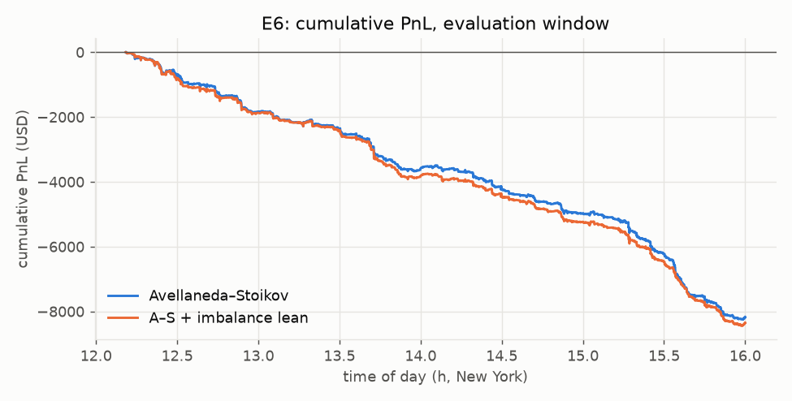

# mmsim — a market-making backtester on real limit-order-book data

An event-driven backtester that replays one day of NASDAQ order-book data (LOBSTER, AAPL, 2012-06-21), lets a quoting strategy rest two-sided limit orders, fills them under a conservative queue model with 100 ms latency, and decomposes PnL into **spread capture**, **inventory carry** and **adverse selection**. Two strategies run on identical data and fill assumptions: a **naive** symmetric quoter and **Avellaneda–Stoikov (2008)** inventory-skewed quoting, with $A$, $k$ and $\gamma$ estimated on a calibration window disjoint from the evaluation window.

**Headline.** Inventory-aware quoting cut inventory standard deviation by **42 %** (378 → 219 shares) and time spent at the position cap from 27 % to 3 %, while retaining **71 %** of spread income. Neither strategy was profitable: A–S quoted a **4.0-tick** half-spread and realised **−2.8 ticks** at 5 s, a gap of **6.8 ticks per share** on a stock whose quoted spread averaged ~18 ticks. That gap splits into 2.1 ticks lost before the fill prints (the mid had already moved toward the resting order, through latency and through-fills) and **4.7 ticks of adverse selection** after it. The decomposition shows *why* the closed-form A–S spread ($\approx 2/k \approx 7$ ticks) is too tight for this name, which is the interesting result, not the sign of the PnL. Two follow-ups: widening the naive quote to just behind the touch (E5, width chosen on the calibration window) turns the evaluation-window loss into a small profit on a ninth of the fills, and leaning quotes on displayed book imbalance (E6) does nothing, because the displayed book carries no information about the next mid move on this feed.



## Reading the summary

The two paragraphs above compress the whole project. This section unpacks them phrase by phrase so that every claim can be traced to the table or formula that produced it.

### First paragraph: what the system is

**"Event-driven backtester."** The simulator does not step through time on a clock. It walks through 634,638 recorded events, one at a time, in the order the exchange produced them. Each event is either a book update (the resting size at one price changed) or a trade (someone crossed the spread). Everything the strategy does happens in response to an event, and the strategy only ever sees the book as it stood at that event. One test wraps the stream so that touching a later event raises; another perturbs every event after a time $t^\ast$ and checks that nothing before $t^\ast$ changes, bit for bit.

**"Replays one day of NASDAQ order-book data (LOBSTER, AAPL, 2012-06-21)."** LOBSTER is an academic service that reconstructs the NASDAQ order book from the exchange's message feed. Its free sample gives one full trading day for a few tickers, with the top 10 price levels on each side after every message. This project uses Apple on 21 June 2012, 09:30 to 16:00. The stock traded near \$580 with a quoted spread of about 18 cents. A tick is one cent, so the spread numbers below are large compared with a typical liquid name today.

**"Lets a quoting strategy rest two-sided limit orders."** A market maker posts a bid (an offer to buy) below the mid and an ask (an offer to sell) above it, then waits for someone to trade against them. "Rest" means the orders sit in the book: we never send a marketable order and never cross the spread. Each side is 100 shares. The strategy's only decision is where to put those two prices, and it is asked again whenever the mid moves, our inventory changes, or 500 ms pass.

**"Fills them under a conservative queue model with 100 ms latency."** Historical data cannot say whether our order would have been filled, because we were not there. The engine has to decide. When our order arrives at a price it joins the back of the displayed queue at that price. A trade at our price consumes the queue ahead of us first; only the volume beyond that is ours. Cancellations by other participants at our price are assumed to come from behind us, so they never advance our position. "Conservative" means each of these choices errs toward fewer fills. "100 ms latency" means an order sent at time $t$ is not live until $t + 100$ ms, and a cancel sent at $t$ can still be filled until $t + 100$ ms. If the market has moved through our price by the time the order arrives it is rejected, as a post-only order would be. The one aggressive choice, that a trade printing through our price fills our whole order, is bounded in E3.

**"Decomposes PnL into spread capture, inventory carry and adverse selection."** Total PnL is one number and says nothing about why it happened. The accounting splits it into three parts. *Spread capture* is what each fill earns relative to the mid at the moment it prints: buying 100 shares 3 ticks below mid captures 300 ticks. *Inventory carry* is what the position we already hold earns or loses as the mid moves between events. These two sum exactly, in integer cents, to total PnL minus fees, and a test enforces the identity. *Adverse selection* is a separate lens on the same fills: how far the mid moved against us in the 1, 5 or 30 seconds after each one. It is not part of the identity, because it overlaps with carry, but it is the number that explains why the carry is negative.

**"Two strategies run on identical data and fill assumptions."** Every comparison in the results changes exactly one thing. The data, the fill model, the latency, the order size, the inventory cap and the fees are the same for both strategies, so any difference in outcome comes from the quoting rule alone.

**"A naive symmetric quoter."** Bid at $m - h$, ask at $m + h$, regardless of what we hold. Long 500 shares, it still bids as eagerly as it asks. This is the control.

**"Avellaneda–Stoikov (2008) inventory-skewed quoting."** The paper solves for the quotes of a risk-averse market maker who wants to end the session flat. Two ingredients. First, a *reservation price*: the mid shifted down when we are long and up when we are short, by an amount proportional to inventory, risk aversion, variance and time remaining. Quotes are centred on the reservation price, so a long position pushes both quotes down, making our ask more likely to be hit and our bid less likely. Second, an *optimal spread* with two terms: an inventory-risk term, and a fill-intensity term $\frac{2}{\gamma}\ln(1 + \gamma/k)$ that depends only on how fast fills decay with distance from mid and tends to $2/k$ as $\gamma$ becomes small.

**"With $A$, $k$ and $\gamma$ estimated on a calibration window disjoint from the evaluation window."** $A$ and $k$ describe how the fill rate falls off as a quote moves away from the mid: $\lambda(\delta) = A e^{-k\delta}$. They are measured by counting, for each distance $\delta$, the trades that would have reached a resting order there, then fitting a line to the log of those counts. $\gamma$ is risk aversion; the model does not say what it should be, so it is swept and one value chosen. All three are set on 09:30 to 12:06 and then frozen. Every reported number comes from 12:11 to 16:00, which those parameters never saw. This is the backtesting equivalent of a train/test split, and it is the reason the results can be trusted not to be overfitted.

### Second paragraph: what was found

**"Inventory-aware quoting cut inventory standard deviation by 42 % (378 → 219 shares)."** From the E1 table. Inventory std is the time-weighted dispersion of the position around zero over the evaluation window. The naive quoter wandered to about ±378 shares; A–S held it to about ±219. This is the model doing what it was designed to do.

**"And time spent at the position cap from 27 % to 3 %."** Both strategies stop bidding at +500 shares and stop asking at −500. The naive quoter spent 27 % of the afternoon pinned at a cap, quoting only one side. A–S spent 3 % there. At the cap you are not a market maker; you are a directional position waiting to be unwound.

**"While retaining 71 % of spread income."** Spread capture was \$5,073 for A–S against \$7,146 for naive, and $5{,}073 / 7{,}146 = 0.71$. The skew has a cost: to unwind a long position A–S moves its ask closer to the mid, so each sell captures less. It gave up 29 % of gross spread revenue to buy the inventory control above.

**"Neither strategy was profitable."** Naive lost \$5,721 and A–S lost \$8,169, on roughly \$160 M of notional traded. The summary says this before anything else so that the positive-looking spread-capture figures do not mislead.

**"A–S quoted a 4.0-tick half-spread and realised −2.8 ticks at 5 s."** The quoted half-spread is how far from the mid our orders sat, averaged over time: 3.96 ticks. The realised half-spread at 5 s is spread capture per share minus adverse selection per share at 5 s: $1.85 - 4.68 = -2.83$ ticks. Read plainly: we posted 4 cents from mid, and five seconds after each fill we were on average 2.8 cents worse off than mid on every share, before any later move.

**"A gap of 6.8 ticks per share."** $3.96 - (-2.83) = 6.79$. This is the distance between what we thought we were charging and what we actually kept. In market-making language it is the cost of trading against informed flow, and it is the headline number of the project.

**"On a stock whose quoted spread averaged ~18 ticks."** Context for the previous number. The best bid and best ask were about 18 cents apart, so the touch sat about 9 ticks from mid. Our 4-tick quotes were well inside the touch, improving the book by around 5 ticks. That is why they were filled so often, and why the loss per fill is so large.

**"That gap splits into 2.1 ticks lost before the fill prints (…) and 4.7 ticks of adverse selection after it."** Quoted half-spread minus spread capture per share is $3.96 - 1.85 = 2.11$ ticks. Spread capture is measured against the mid when the trade prints, not when we posted. If we post a bid 4 ticks below mid and the mid then falls 2 ticks before someone sells to us, we capture only 2. Two mechanisms do this: latency (the mid moves during the 100 ms before the order is live) and through-fills (an aggressive seller prints below our bid, taking us at our price after the mid has already gapped down). The remaining 4.68 ticks is the adverse-selection column: the mid keeps moving against us for five seconds after we are filled. $2.11 + 4.68 = 6.79$.

**"The decomposition shows why the closed-form A–S spread ($\approx 2/k \approx 7$ ticks) is too tight for this name."** With $k = 0.293$ per tick, $2/k = 6.8$ ticks of total spread, or 3.4 per side. That spread is optimal under the paper's assumption that flow is uninformed, so the only trade-off is fill rate against capture. On this feed the flow is informed: whoever hits our quote knows, on average, that the price is about to move 4.7 ticks their way. A spread set from fill rates alone cannot see that, so it lands at a width where every fill loses. Knowing that the loss is adverse selection, rather than a bad $\gamma$ or an unlucky trend, is the point of doing the decomposition.

**"Which is the interesting result, not the sign of the PnL."** One day of one stock cannot establish whether a strategy is profitable. It can establish how the PnL is made up, and that structure, spread income smaller than post-fill drift at every width tried, is a property of the flow rather than of the day.

**"Widening the naive quote to just behind the touch (E5, width chosen on the calibration window) turns the evaluation-window loss into a small profit on a ninth of the fills."** E5 sweeps the naive half-spread $h$ on the calibration window. $h = 12$ ticks, 2 to 3 ticks behind the touch, gives the best PnL there and is then run once on the evaluation window. Fills drop from 3,100 to 343, roughly one ninth, and PnL goes from −\$5,721 to +\$1,378. Adverse selection per fill barely changes (5.3 ticks against 4.9), which is the important part. Widening does not make the flow less informed; it charges enough per fill to cover what the flow takes.

**"Leaning quotes on displayed book imbalance (E6) does nothing."** If informed flow is the problem, the natural fix is to predict it. E6 tries the simplest signal, the imbalance between best-bid size and best-ask size, and shifts the reservation price by $\beta$ times that imbalance. On the calibration window the imbalance has $R^2 = 0.000$ against the next 5 s mid move. Run anyway, the best $\beta$ removes 0.15 ticks of adverse selection and gives back more in spread capture. Total PnL is unchanged within noise.

**"Because the displayed book carries no information about the next mid move on this feed."** LOBSTER shows one venue's displayed orders. In 2012 AAPL traded across a dozen venues, hidden orders were common (372 hidden executions were dropped at load), and fast participants reacted to those other venues well inside 100 ms. The people picking off our quotes are acting on information that is not in the book we can see. On this data the only lever that works is price (E5), not prediction (E6).

## Method

**Data.** LOBSTER free sample, AAPL, 2012-06-21, 10 levels: 400,391 messages → 634,638 canonical events (600,020 level updates, 34,618 trades with aggressor side). Prices are integer ticks (\$0.01), times int64 nanoseconds, quantities shares; no floats inside the engine. Replay of the event stream reproduces the source book with zero mismatches at all 10 levels (`scripts/validate_replay.py`). 372 hidden executions at sub-penny midpoints were dropped. Details in `data/README.md`.

**Windows.** Calibration 09:30–12:06 (used for $A$, $k$, $\sigma_{\text{cal}}$, $\beta$, and the choice of $\gamma$, the E5 width and the E6 lean), a 5-minute gap, evaluation 12:11–16:00 (reported). No reported parameter was chosen on evaluation data.

**Fill model, stated bluntly.**
- Our orders never move the historical book and never cross the spread (maker only).
- An order becomes live 100 ms after it is sent; a cancel takes effect 100 ms after it is sent (the order can still be filled meanwhile). An order that would cross the market when it arrives is rejected (post-only). At most one unacknowledged order per side.
- On arrival, `queue_ahead` = displayed size at our price (0 if we improve the book). A trade **at** our price consumes queue first, then fills us. A trade **through** our price fills our whole order (spec default; the alternative that caps the fill at the print size is reported in E3). Cancellations at our price are assumed to come from *behind* us (conservative; a proportional model is reported in E3).
- Fixed 100 shares per side, cap $|q| \le 500$ (bid suppressed at the long cap, ask at the short cap). Requote when the mid moves, inventory changes, or 500 ms elapse; unchanged prices keep their queue position.
- Fees: 0 bps. NASDAQ paid maker rebates in 2012; we ignore both fees and rebates so PnL is not flattered. E4 shows what a 1 bps or 10 bps fee would do.

**Strategies.** The naive quoter is symmetric about the mid $m$ and ignores inventory:

$$
\text{bid} = m - h, \qquad \text{ask} = m + h
$$

with $h$ set to the A–S half-spread at $q = 0$ rounded to the grid ($\delta^\ast / 2 = 3.4 \to 3$ ticks), so that E1 compares the two quoters at the same width. The match is imperfect: A–S rounds its bid down and its ask up, so its time-weighted half-spread is 3.96 ticks against 3.21 for the naive quoter (E1 table). Naive is 0.75 ticks tighter, which accounts for part of its higher fill count; the skew comparison should be read with that in mind.

Avellaneda–Stoikov (2008) takes the mid $s$, inventory $q$, volatility $\sigma$, risk aversion $\gamma$, fill-intensity decay $k$ and time-to-horizon $\tau = T - t$. The reservation price shifts the mid against the current position:

$$
r(s, q, t) = s - q\,\gamma\,\sigma^2\,\tau
$$

The optimal total spread has an inventory-risk term and a fill-intensity term:

$$
\delta^\ast(t) = \gamma\,\sigma^2\,\tau + \frac{2}{\gamma}\ln\!\left(1 + \frac{\gamma}{k}\right)
$$

and the quotes are centred on the reservation price:

$$
\text{bid} = r - \frac{\delta^\ast}{2}, \qquad \text{ask} = r + \frac{\delta^\ast}{2}
$$

E6 adds an optional lean on the touch imbalance $I = (\text{bid size} - \text{ask size}) / (\text{bid size} + \text{ask size}) \in [-1, 1]$, computed from the current book only:

$$
r = s - q\,\gamma\,\sigma^2\,\tau + \beta\,I
$$

with $\beta$ in ticks per unit imbalance; $\beta = 0$ (the default, used everywhere except E6) is plain A–S.

The horizon is held constant at $\tau = 60$ s, the standard practical choice, so $\gamma$ absorbs the scale. Under the paper's finite horizon the skew and the risk term fade to zero at the close and the spread tends to its fill-intensity term, about $2/k$, which produces end-of-session artefacts. Volatility is a trailing realised variance of the mid over a window of $W = 300$ s, sampled every 1 s to suppress microstructure noise, with $\Delta m_j$ the sampled mid changes in that window:

$$
\hat\sigma^2 = \frac{1}{W}\sum_{j}\left(\Delta m_j\right)^2, \qquad \sigma = \sqrt{\hat\sigma^2}
$$

Units: $s$, $r$, bid, ask and $\delta^\ast$ in ticks; $q$ in shares; $\sigma$ in $\text{ticks}/\sqrt{\text{s}}$; $\tau$ in seconds; $\gamma$ in $\text{ticks}^{-1}\,\text{share}^{-1}$; $k$ in $\text{ticks}^{-1}$. Both terms of $\delta^\ast$ then come out in ticks. A construction-time assertion checks that $\delta^\ast(q = 0)$ lands in 0.5–50 ticks so unit errors abort the run instead of producing 0.001-tick or 10,000-tick spreads.

**Calibration.** A–S assumes a resting order $\delta$ ticks from the mid is filled by a Poisson process whose intensity decays exponentially with distance:

$$
\lambda(\delta) = A\,e^{-k\delta}
$$

For $\delta = 1, \dots, 40$ ticks, count the trades in the calibration window that would have filled a resting order at $\text{mid} \pm \delta$ (prints at or through that price by the opposite aggressor), divide by the window length to get $\hat\lambda(\delta)$ per second, average the two sides, and fit by OLS over grid points with at least 30 events:

$$
\ln\hat\lambda(\delta) = \ln A - k\,\delta
$$

Result: $A = 1.53$ fills/s, $k = 0.293$ per tick, $R^2 = 0.987$ on $\delta \in [1, 21]$; $\sigma_{\text{cal}} = 4.09$ $\text{ticks}/\sqrt{\text{s}}$. Buy aggressors reach further from the mid than sellers (visible in the figure); sides are averaged, so $A$ is a per-side rate.

For E6 the same script also regresses the mid move over the next 5 s on the touch imbalance sampled every second: $\beta = 0.24$ ticks per unit imbalance, $R^2 = 0.000$ on 9,354 samples. The displayed touch has no predictive power here; E6 therefore sweeps the lean size directly rather than trusting this slope.



**PnL accounting.** With cash $C_t$, inventory $q_t$ and mid $m_t$ (all integers, $C_0 = q_0 = 0$), mark-to-market PnL at every event is

$$
\text{PnL}_t = C_t + q_t\,m_t - \text{Fees}_t
$$

A fill at price $p$ for quantity $x$ when the mid is $m_{t_f}$ earns spread capture against the mid at fill time:

$$
\text{SC} = \begin{cases} (m_{t_f} - p)\,x & \text{buy} \\ (p - m_{t_f})\,x & \text{sell} \end{cases}
$$

Inventory carry accumulates between events on the position held *before* each mid move:

$$
\text{IC}_T = \sum_{t} q_{t^-}\,(m_t - m_{t^-})
$$

These satisfy an identity that holds exactly in integer arithmetic and is enforced by a test:

$$
\text{PnL}_T = \sum_{\text{fills}} \text{SC} + \text{IC}_T - \text{Fees}_T
$$

Adverse selection at horizon $\Delta t$ is the mid move against us after each fill,

$$
\text{AS}_{\Delta t} = \begin{cases} (m_{t_f} - m_{t_f + \Delta t})\,x & \text{buy} \\ (m_{t_f + \Delta t} - m_{t_f})\,x & \text{sell} \end{cases}
$$

reported at $\Delta t \in \{1, 5, 30\}$ s. The realised spread at horizon $\Delta t$ is $\text{SC} - \text{AS}_{\Delta t}$. The gap between the quoted half-spread and the realised half-spread is the headline "cost of informed flow" number; it splits into the part lost before the fill prints (quoted half-spread minus per-share SC, because the mid can move toward a resting order before it is hit) and the part lost after ($\text{AS}_{\Delta t}$).

## Results (evaluation window, 12:11–16:00)

**Experiments.** Six experiments, each answering one question on the same data and fill model. No parameter value was chosen using evaluation-window data: every swept quantity is selected on the calibration window and run once on evaluation. E5 and E6 were designed after E1's evaluation results showed the size of the adverse selection, so they are follow-ups, not pre-registered.

| | question | window |
|---|---|---|
| E1 | What does skewing quotes on inventory buy, holding everything else fixed? Naive vs A–S with the same half-spread at $q = 0$. | evaluation |
| E2 | Which $\gamma$ do we commit to, and how does it trade PnL against inventory control? | calibration only |
| E3 | How much do the results depend on fill-model assumptions that historical data cannot verify: latency, queue cancellations, through-fills? | evaluation |
| E4 | Would the strategy survive a venue that charges real maker fees? | evaluation |
| E5 | Does widening the quote fix the loss, and at what cost in fills? Naive half-spread swept, chosen value reported. | calibration, then evaluation |
| E6 | Does leaning quotes on displayed book imbalance reduce adverse selection? Lean size swept, chosen value reported. | calibration, then evaluation |

### E1 — Naive vs Avellaneda–Stoikov ($\gamma = 3\times10^{-5}$ from E2)

| metric | Naive | A–S |
|---|---:|---:|
| quoted half-spread (ticks, time-weighted) | 3.21 | 3.96 |
| fills | 3,100 | 2,935 |
| spread capture (USD) | +7,146 | +5,073 |
| inventory carry (USD) | −12,867 | −13,242 |
| fees (USD) | 0 | 0 |
| **total PnL (USD)** | **−5,721** | **−8,169** |
| adverse selection at 1 s / 5 s / 30 s (USD) | 10,935 / 14,047 / 14,536 | 10,240 / 12,844 / 13,382 |
| adverse selection at 5 s (ticks per share) | 4.85 | 4.68 |
| realised half-spread at 5 s (ticks) | −2.38 | −2.83 |
| inventory std (shares, time-weighted) | 378 | 219 |
| max \|inventory\| (shares) | 696 | 671 |
| fraction of time at cap | 27 % | 3 % |
| fraction of time quoting both sides | 73 % | 96 % |
| max drawdown (USD) | 6,064 | 8,257 |
| per-minute Sharpe (unannualised) | −0.28 | −0.62 |




Reading the decomposition: both strategies earn a positive spread against the mid at fill time, then lose it (and more) as the mid moves against the position they just acquired. Adverse selection at 5 s exceeds spread capture by a factor of 2.0 (naive) and 2.5 (A–S). The A–S skew keeps inventory near zero (mean 13 shares vs 58) and almost never touches the cap, but it pays for that by quoting the unwinding side closer to the mid, so it captures 1.85 ticks per share against 2.47 for the naive quoter, despite quoting 0.75 ticks wider on average. Inventory carry is roughly unchanged despite the much smaller inventory, because most of the carry *is* adverse selection: the position is largest exactly when the price is about to move against it. Skewing quotes on inventory does not fix that; wider spreads or adverse-selection-aware quoting would.

### E2 — choosing $\gamma$ (calibration window only)

| $\gamma$ | 1e-6 | 3e-6 | 1e-5 | **3e-5** | 1e-4 | 3e-4 | 1e-3 |
|---|---:|---:|---:|---:|---:|---:|---:|
| PnL (USD) | −5,799 | −6,296 | −7,636 | **−8,676** | −10,080 | −11,804 | −13,808 |
| inventory std (shares) | 375 | 361 | 313 | **223** | 118 | 81 | 56 |
| time at cap | 26 % | 21 % | 13 % | **3 %** | 0 % | 0 % | 0 % |
| quoted half-spread (ticks) | 3.9 | 3.9 | 3.9 | **4.1** | 5.1 | 10.0 | 27.5 |

The spec's selection rule (PnL per unit inventory std) degenerates when every $\gamma$ loses money, so $\gamma$ was chosen as the best PnL subject to spending ≤ 5 % of the time at the cap. $\gamma$ trades PnL for inventory control monotonically; below $10^{-4}$ the spread term is essentially $2/k$ and $\gamma$ acts purely as an inventory knob.



### E3 — fill-model sensitivity (A–S, evaluation window)

| latency (ms) | 0 | 50 | **100** | 250 | 500 |
|---|---:|---:|---:|---:|---:|
| PnL, cancels from behind (USD) | −10,033 | −8,352 | **−8,169** | −7,947 | −7,924 |
| PnL, proportional cancel model (USD) | −10,259 | −8,423 | −8,394 | −7,952 | −7,952 |
| fills (behind / proportional) | 4,079 / 4,565 | 3,003 / 3,276 | 2,935 / 3,161 | 2,756 / 2,948 | 2,579 / 2,791 |

Through-fill rule at 100 ms: full-order fill (spec, reported) −8,169 USD with 2,935 fills; capped at the print size −7,438 USD with 4,190 (smaller) fills.

Zero latency is *worse* here, not better: it produces more fills, and fills are loss-making on average. The queue-cancel model moves PnL by < 3 %. The reported configuration (100 ms, cancels from behind) is the conservative choice for fill *rates*; the full through-fill rule is the aggressive choice for fill *size*, and its alternative is shown above. The results do not hinge on either.



### E4 — fees

| fee | total fees (USD) | PnL (USD) |
|---|---:|---:|
| venue (0 bps, rebate ignored) | 0 | −8,169 |
| hypothetical 1 bps | 15,952 | −24,120 |
| hypothetical 10 bps (crypto-spot-like) | 159,387 | −167,556 |

At a \$580 share price, 2,935 fills of ~100 shares is ~\$160 M notional; even 1 bps dwarfs every other term. Any crypto-spot version of this strategy is fee-dominated.

### E5 — how wide is wide enough (naive half-spread sweep)

Naive quoter, everything else as E1, on the calibration window:

| half-spread $h$ (ticks) | 3 | 5 | 8 | 10 | **12** | 15 | 20 |
|---|---:|---:|---:|---:|---:|---:|---:|
| fills | 2,383 | 1,984 | 1,125 | 752 | **526** | 299 | 100 |
| PnL (USD) | −6,571 | −2,838 | −36 | +125 | **+1,883** | +1,422 | −23 |
| spread capture (ticks/share) | 2.46 | 3.91 | 5.68 | 6.50 | **6.84** | 7.46 | 8.20 |
| adverse selection at 5 s (ticks/share) | 5.78 | 6.00 | 6.39 | 6.45 | **7.26** | 5.88 | 6.22 |

$h = 12$ has the best calibration PnL and is then run once on the evaluation window against the E1 setting:

| evaluation window | $h = 3$ (E1) | $h = 12$ |
|---|---:|---:|
| fills | 3,100 | 343 |
| total PnL (USD) | −5,721 | +1,378 |
| spread capture (ticks/share) | 2.47 | 5.08 |
| adverse selection at 5 s (ticks/share) | 4.85 | 5.27 |
| realised half-spread at 5 s (ticks) | −2.38 | −0.19 |
| inventory std (shares) | 378 | 341 |



The adverse-selection column is the point: the post-fill move is 5 to 7 ticks at every width. Widening does not make the flow less informed. It only raises what each fill captures until that covers the loss, which happens around the touch (the spread averaged about 18 ticks, so the best quotes sit about 9 ticks from mid; $h = 12$ rests 2 to 3 ticks behind them in an existing queue). Past 15 ticks fills dry up and PnL returns to zero. At $h = 12$ the realised half-spread at 5 s is still about zero, yet total PnL is positive because part of the 5 s move reverts: adverse selection falls from 5.27 ticks at 5 s to 4.06 at 30 s, so the realised half-spread at 30 s is +1.0 tick, and inventory carry over the window is only −107 USD. Widening turns a loss into a small profit on a ninth of the fills. The +1,378 USD on 343 fills over four hours is within noise for a single day; the robust finding is the shape of the curve, not the sign. It is a price lever, not a prediction.

### E6 — leaning on book imbalance (adverse-selection-aware skew)

A–S with the chosen $\gamma$ plus the lean term above. Since the fitted slope is effectively zero, the lean $\beta$ is swept directly on the calibration window and chosen by the E2 rule:

| $\beta$ (ticks per unit imbalance) | 0 | 1 | **2** | 4 | 8 |
|---|---:|---:|---:|---:|---:|
| PnL (USD) | −8,676 | −8,713 | **−8,647** | −9,250 | −10,169 |
| adverse selection at 5 s (ticks/share) | 5.68 | 5.67 | **5.66** | 5.56 | 5.58 |
| spread capture (ticks/share) | 1.50 | 1.45 | **1.44** | 1.22 | 0.47 |

| evaluation window | A–S | A–S + lean ($\beta = 2$) |
|---|---:|---:|
| fills | 2,935 | 2,940 |
| total PnL (USD) | −8,169 | −8,342 |
| adverse selection at 5 s (ticks/share) | 4.68 | 4.53 |
| realised half-spread at 5 s (ticks) | −2.83 | −2.73 |
| inventory std (shares) | 219 | 219 |




A clean null. The lean shaves 0.15 ticks off adverse selection, gives back more in spread capture, and larger leans lose money outright. On the calibration window the touch imbalance has a correlation of about 0.02 with the next 1 s and 5 s mid move; depth over 3 or 5 levels, signed trade flow over 5 s and 30 s, and the sign of the last trade were also checked and none exceeds 0.1. The flow that picks these quotes off is not visible in the displayed NASDAQ book. That is consistent with hidden orders (372 sub-penny hidden executions were dropped at load), with AAPL trading on a dozen other venues that this feed does not show, and with participants reacting to those venues faster than 100 ms. On a single-venue feed the only lever that works here is price (E5), not prediction.

## Limitations

- One day, one symbol. Everything above is a single sample from a day on which AAPL trended down; the sign of inventory carry is not a property of the strategy.
- Historical fills cannot move the book, and our quotes never change other participants' behaviour (no market impact, no reaction to our presence).
- The queue model is conservative in one direction (cancellations assumed behind us) and the through-fill rule is aggressive in the other (a small print through us fills our whole order); E3 bounds both.
- Only 10 book levels are visible; a level scrolling out of the window is treated as removed.
- A–S assumes uninformed Poisson flow, which the decomposition shows is false here. The one adverse-selection signal tried (E6, displayed touch imbalance) has no power on this feed, and trade-flow and deeper-book signals checked on the calibration window are similarly weak.

## Reproduce

```
uv sync
uv run pytest                                    # 92 tests: book, fill model, PnL identity (exact), no-lookahead, determinism, A-S units, calibration
uv run python scripts/build_events.py           # raw LOBSTER -> data/processed/.../events.parquet
uv run python scripts/validate_replay.py        # must print zero top-of-book mismatches
uv run python scripts/calibrate.py              # A, k, sigma_cal, beta -> results/calibration/
uv run python scripts/run_experiments.py        # E2 -> E1 -> E3 -> E4 -> E5 -> E6 -> results/<exp>/summary.csv + figures
```

Raw LOBSTER files (`AAPL_2012-06-21_34200000_57600000_{message,orderbook}_10.csv`) go in `data/raw/`; see `data/README.md`.

## Layout

`mm/events.py` schema · `mm/loaders.py` LOBSTER → events · `mm/book.py` order book · `mm/engine.py` event loop, order manager, fill model, latency, cap (~320 lines) · `mm/strategy.py` Naive and A–S quoters · `mm/vol.py` σ estimators · `mm/calibrate.py` A, k, β · `mm/pnl.py` accounting and decomposition (integer-exact identity) · `mm/metrics.py` summary statistics · `scripts/` build, validate, calibrate, run, experiments · `tests/`.
